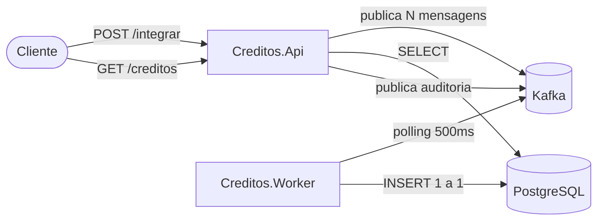
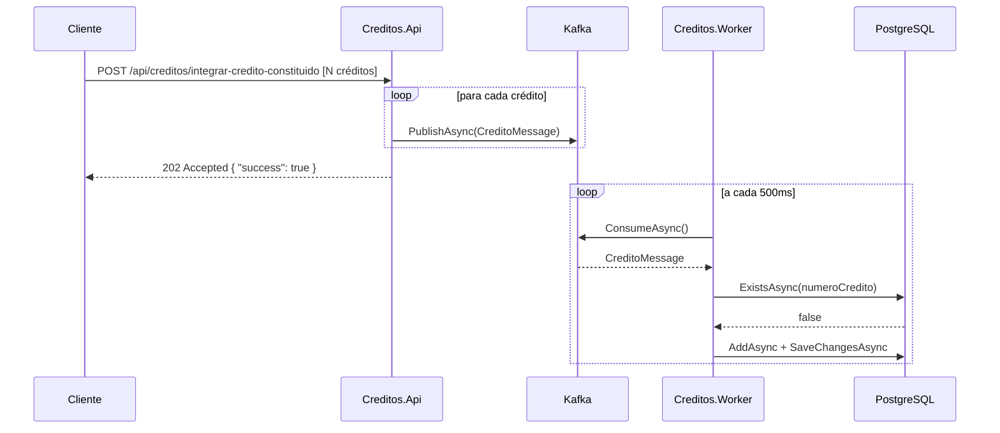
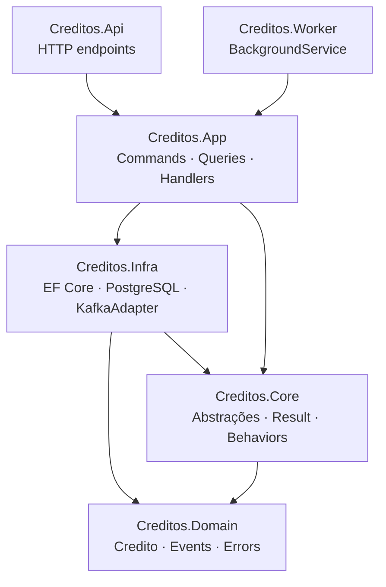
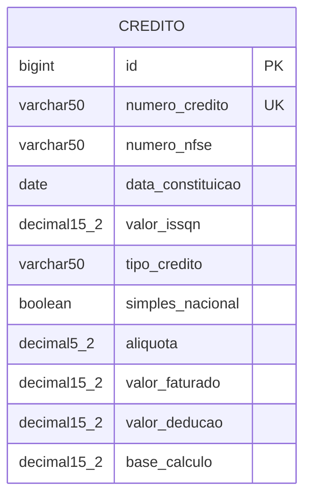

# Creditos API — Desafio Técnico

API REST + Background Service para integração e consulta de créditos constituídos (ISSQN/NFS-e).

> **Notas de implementação**
> - O spec usa `.NET Core 6.0^` — .NET 6 atingiu End of Life em novembro de 2024 e não recebe mais patches de segurança. Foi usado .NET 10, a versão atual com suporte até 2027, conforme [recomendação oficial da Microsoft](https://dotnet.microsoft.com/pt-br/download/dotnet/6.0).
> - `simplesNacional` é recebido como `"Sim"`/`"Não"` na API — exatamente como especificado — e validado via FluentValidation. A conversão para `bool` ocorre no handler antes de persistir; boolean é o tipo semântico correto para dados binários.
> - Minimal API substitui MVC clássico: é a evolução oficial introduzida no .NET 6, preserva a mesma separação de responsabilidades (endpoint ≡ controller + action) com menos boilerplate.

---

## Checklist de Requisitos

### Funcionalidades
- [x] `POST /api/creditos/integrar-credito-constituido` → 202 Accepted
- [x] Worker polling 500 ms — consome do bus e insere créditos individualmente
- [x] `GET /api/creditos/{numeroNfse}` — lista créditos por NFS-e
- [x] `GET /api/creditos/credito/{numeroCredito}` — detalhe de um crédito
- [x] `GET /self` — health liveness
- [x] `GET /ready` — health readiness (verifica DB)

### Requisitos Técnicos
- [x] .NET 10, C# 13
- [x] Entity Framework Core + migrations
- [x] PostgreSQL em container com volume persistente (`creditos_pgdata`)
- [x] Kafka em container (`confluentinc/cp-kafka:7`, modo KRaft — sem Zookeeper)
- [x] Docker Compose: Api + Worker + PostgreSQL + Kafka
- [x] Padrões: Repository, Factory, Singleton (ver seção [Padrões](#padrões-e-arquitetura))
- [x] SOLID, DRY, KISS (ver seção [Padrões](#padrões-e-arquitetura))
- [x] Testes unitários — xUnit + NSubstitute + FluentAssertions
- [x] Testes de integração — WebApplicationFactory
- [x] Commits organizados (Conventional Commits)
- [x] README com instruções de instalação e execução

### Desafios Extras
- [x] Publisher Kafka: cada GET publica evento de auditoria no tópico `consulta-credito-entry`
- [x] `KafkaAdapter` — implementação concreta via `Confluent.Kafka`

### Quality Gates (adicional)
- [x] `dotnet format` — formatação verificada no CI
- [x] `dotnet list package --vulnerable` — CVEs bloqueiam o CI
- [x] Cobertura mínima de 60% (gate coverlet)
- [x] CodeQL — análise SAST em cada push/PR e semanal
- [x] Dependabot — PRs automáticos para NuGet e GitHub Actions

> Detalhes, cobertura e vantagens de cada ferramenta: [docs/quality-gates.md](docs/quality-gates.md)

---

## Pré-requisitos

- [Docker Desktop](https://www.docker.com/products/docker-desktop) (obrigatório — Api, Worker, PostgreSQL e Kafka sobem em containers)
- [.NET 10 SDK](https://dotnet.microsoft.com/download/dotnet/10.0) (opcional — apenas para `dotnet test` local)

---

## Execução

```bash
docker compose up --build
```

| Serviço | URL | Descrição |
|---|---|---|
| Creditos API | http://localhost:8080 | REST + Scalar UI |
| Scalar (docs) | http://localhost:8080/scalar | Documentação interativa (apenas em desenvolvimento) |
| PostgreSQL | localhost:5432 | Banco de dados |
| Worker | — | Sem porta exposta; consome mensagens do Kafka |

---

## Testes

```bash
dotnet test
```

37 testes: 27 unitários + 10 de integração.

---

## Exemplos de uso

```bash
# Integrar créditos
curl -X POST http://localhost:8080/api/creditos/integrar-credito-constituido \
  -H "Content-Type: application/json" \
  -d '[
    {
      "numeroCredito": "123456",
      "numeroNfse": "7891011",
      "dataConstituicao": "2024-03-01",
      "valorIssqn": 500.00,
      "tipoCredito": "ISSQN",
      "simplesNacional": "Sim",
      "aliquota": 5.00,
      "valorFaturado": 10000.00,
      "valorDeducao": 0.00,
      "baseCalculo": 10000.00
    }
  ]'

# Consultar por NFS-e
curl http://localhost:8080/api/creditos/7891011

# Consultar por número do crédito
curl http://localhost:8080/api/creditos/credito/123456

# Health
curl http://localhost:8080/self
curl http://localhost:8080/ready
```

---

## Diagramas

### Arquitetura do Sistema



### Fluxo do POST — Integração Assíncrona



### Camadas da Solução (VSA)



### Modelo de Dados



---

## Padrões e Arquitetura

A solução foi estruturada em torno de três decisões centrais de arquitetura: **isolamento por feature**, **separação de responsabilidades entre processos** e **inversão de dependência em todos os limites**.

O código de negócio vive inteiramente em `Creditos.App` — handlers, validadores, contratos de repositório. Nem a API nem o Worker contêm lógica; ambos são entry points que delegam ao Mediator e consomem os mesmos handlers. Isso significa que adicionar um novo transporte (gRPC, fila, CLI) não exige tocar nas regras de negócio.

A mensageria é abstraída por interfaces no `Creditos.Core`. O `KafkaAdapter` em Infra é a única implementação concreta; testes unitários substituem por mocks sem nenhuma alteração nos handlers. O mesmo princípio vale para o repositório: handlers conhecem `ICreditoRepository`, nunca o EF Core diretamente.

A resiliência do Worker é tratada na borda do processo — `PeriodicTimer` elimina drift de intervalo e o `ResiliencePipeline` (Polly) absorve falhas transitórias de rede e banco antes que derrubem o serviço. O circuito abre automaticamente quando a infra está degradada.

Erros de negócio (crédito não encontrado, duplicidade) não usam exceções — transitam como `Result<T>` do handler até o endpoint, que decide o status HTTP. Exceções ficam reservadas para falhas inesperadas de infraestrutura.

---

### Nested Static Partial Classes

A camada `App` organiza as features usando **nested static partial classes** em vez de namespaces por subpasta. A classe estática `Credito` atua como agregador de funcionalidades relacionadas à entidade — cada operação é encapsulada em uma subclasse estática (`IntegrarCredito`, `GetCreditosByNfse`, `GetCreditoByNumero`, `ProcessarCredito`), mantendo alta coesão e baixo acoplamento.

```csharp
// namespace único: Creditos
// arquivo: App/Creditos/GetCreditoByNumero/Handler.cs
public static partial class Credito
{
    public static partial class GetCreditoByNumero
    {
        public sealed record Query(string NumeroCredito) : IQuery<Result<Response>>;
        public sealed record Response(string NumeroCredito, string NumeroNfse, ...);
        public sealed partial class Handler(...) : IQueryHandler<Query, Result<Response>> { ... }
    }
}
```

**O que isso entrega:**

| Aspecto | Benefício |
|---|---|
| **Descoberta** | `Credito.` no IntelliSense lista imediatamente todas as operações disponíveis |
| **Agrupamento** | O sistema de tipos substitui a hierarquia de pastas — sem ambiguidade de namespaces |
| **Colisão zero** | `Handler` existe em cada slice sem conflito de nome — o compilador os diferencia por tipo enclosing |
| **Overhead zero** | `static` garante que o compilador não gera nenhum objeto em runtime; é açúcar de compilação puro |
| **Testes diretos** | `using static Creditos.Credito.IntegrarCredito;` traz `Handler`, `Command`, `Response` direto para o escopo do teste |

### Módulos

Cada camada expõe um método de extensão de `IServiceCollection` que encapsula seu registro no DI. `CreditosModule` registra validadores e demais dependências da camada App; `InfrastructureExtensions` registra o DbContext, o `KafkaAdapter` e o repositório. O `Program.cs` de cada entry point encadeia essas chamadas sem conhecer nenhum detalhe interno das camadas — toda a composição do container ocorre nas bordas, não no centro.

### Vertical Slice Architecture (VSA)

Cada feature é auto-contida: `Command`/`Query` + `Handler` + `Validator` + `Response`. Handlers não se conhecem; mudanças são isoladas por slice. Novos endpoints são adicionados sem tocar nos existentes.

### Separação Api / Worker

| Projeto | Responsabilidade |
|---|---|
| `Creditos.Api` | Recebe a lista via HTTP e publica N mensagens no Kafka |
| `Creditos.Worker` | Polling 500 ms, consome 1 mensagem por tick, persiste individualmente |
| `Creditos.App / Infra / Domain` | Camadas compartilhadas — sem duplicação de lógica |

### Mediator (source-generated)

Zero reflection em runtime. Handlers registrados em tempo de compilação via `Mediator.SourceGenerator`. Pipeline: `LoggingBehavior → ValidationBehavior → Handler`.

### Result Pattern

Sem exceções no fluxo de negócio. `Result<T>` com `IsSuccess / IsFailure / Error`. Endpoints fazem `result.Match(ok => 200, err => 404/400)`.

### Resiliência no Worker (Polly)

`PeriodicTimer(500ms)` + `ResiliencePipeline`:

| Estratégia | Configuração |
|---|---|
| Retry | 3 tentativas, backoff exponencial (1 s, 2 s, 4 s) |
| Circuit Breaker | Abre após 50% de falhas em 30 s (mín. 5 requisições); pausa 30 s |

### Mensageria abstraída

`IMessagePublisher` / `IMessageConsumer` no Core — handlers dependem das interfaces, não da implementação. `KafkaAdapter` (em Infra) é a única implementação concreta, registrada via DI.

**Dois tópicos Kafka:**

| Tópico | Uso |
|---|---|
| `integrar-credito-constituido-entry` | Créditos recebidos via POST (fluxo principal) |
| `consulta-credito-entry` | Evento de auditoria publicado a cada GET (desafio extra) |

### SOLID, DRY e KISS

**S** — cada classe tem uma responsabilidade: Handler processa, Repository persiste, Worker consome.  
**O** — novas features são novos slices, sem modificar os existentes.  
**L** — `KafkaAdapter` pode ser substituído por qualquer implementação de `IMessagePublisher`.  
**I** — `IMessagePublisher` e `IMessageConsumer` são interfaces separadas.  
**D** — handlers dependem de `ICreditoRepository`, não de `EfCoreCreditoRepository`.

**DRY:** lógica em um único lugar (`Creditos.App`); Api e Worker reutilizam via Mediator.  
**KISS:** sem Event Sourcing, sem read models separados, sem frameworks de scheduler desnecessários.

### Padrões de Projeto

| Padrão | Onde |
|---|---|
| **Repository** | `ICreditoRepository` (App) + `EfCoreCreditoRepository` (Infra) |
| **Factory** | `static Credito Create(...)` no aggregate root (Domain) |
| **Singleton** | `IProducer<string,string>` (Confluent.Kafka) — thread-safe, caro de instanciar |
| **MVC** | Substituído por **Minimal API + VSA** — padrão .NET 9/10; mesma separação de responsabilidades com menos boilerplate. Swashbuckle (Swagger) usa reflection em runtime e é incompatível com Native AOT — **Scalar + `Microsoft.AspNetCore.OpenApi`** gera o documento via source generator em tempo de compilação, mantendo compatibilidade AOT total. |
